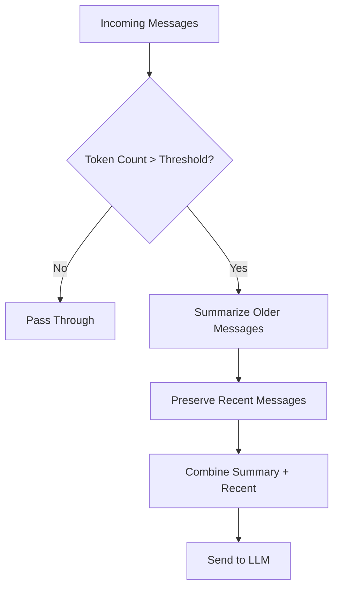

# Async Context Compression（异步上下文压缩）

<span class="category-badge filter">Filter</span>
<span class="version-badge">v1.1.0</span>

通过智能摘要减少长对话的 token 消耗，同时保持对话连贯。

---

## 概览

Async Context Compression 过滤器通过以下方式帮助管理长对话的 token 使用：

- 智能总结较早的消息
- 保留关键信息
- 降低 API 成本
- 保持对话一致性

特别适用于：

- 长时间会话
- 多轮复杂讨论
- 成本优化
- 上下文长度控制

## 功能特性

- :material-arrow-collapse-vertical: **智能压缩**：AI 驱动的上下文摘要
- :material-clock-fast: **异步处理**：后台非阻塞压缩
- :material-memory: **保留上下文**：尽量保留重要信息
- :material-currency-usd-off: **降低成本**：减少 token 使用

---

## 安装

1. 下载插件文件：[`async_context_compression.py`](https://github.com/Fu-Jie/awesome-openwebui/tree/main/plugins/filters/async-context-compression)
2. 上传到 OpenWebUI：**Admin Panel** → **Settings** → **Functions**
3. 配置压缩参数
4. 启用过滤器

---

## 工作原理



---

## 配置项

| 选项 | 类型 | 默认值 | 说明 |
|--------|------|---------|-------------|
| `token_threshold` | integer | `4000` | 超过该 token 数触发压缩 |
| `preserve_recent` | integer | `5` | 保留不压缩的最近消息数量 |
| `summary_model` | string | `"auto"` | 用于摘要的模型 |
| `compression_ratio` | float | `0.3` | 目标压缩比例 |

---

## 示例

### 压缩前

```
[Message 1] User: Tell me about Python...
[Message 2] AI: Python is a programming language...
[Message 3] User: What about its history?
[Message 4] AI: Python was created by Guido...
[Message 5] User: And its features?
[Message 6] AI: Python has many features...
... (many more messages)
[Message 20] User: Current question
```

### 压缩后

```
[Summary] Previous conversation covered Python basics,
history, features, and common use cases...

[Message 18] User: Recent question about decorators
[Message 19] AI: Decorators in Python are...
[Message 20] User: Current question
```

---

## 运行要求

!!! note "前置条件"
    - OpenWebUI v0.3.0 及以上
    - 需要可用的 LLM 用于摘要

!!! tip "最佳实践"
    - 根据模型上下文窗口设置合适的 token 阈值
    - 技术讨论可适当提高 `preserve_recent`
    - 先在非关键对话中测试压缩效果

---

## 常见问题

??? question "没有触发压缩？"
    检查 token 数是否超过配置的阈值，并开启调试日志了解细节。

??? question "重要上下文丢失？"
    提高 `preserve_recent` 或降低压缩比例。

---

## 源码

[:fontawesome-brands-github: 在 GitHub 查看](https://github.com/Fu-Jie/awesome-openwebui/tree/main/plugins/filters/async-context-compression){ .md-button }
