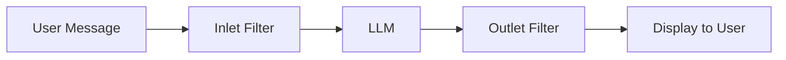

# Filter Plugins

Filter plugins process and modify messages before they are sent to the LLM or after responses are generated.

## What are Filters?

Filters act as middleware in the message pipeline:

- :material-arrow-right-bold: **Inlet**: Process user messages before they reach the LLM
- :material-arrow-left-bold: **Outlet**: Process LLM responses before they're displayed
- :material-stream: **Stream**: Process streaming responses in real-time

---

## Available Filter Plugins

<div class="grid cards" markdown>

-   :material-arrow-collapse-vertical:{ .lg .middle } **Async Context Compression**

    ---

    Reduces token consumption in long conversations through intelligent summarization while maintaining coherence.

    **Version:** 1.1.0

    [:octicons-arrow-right-24: Documentation](async-context-compression.md)

-   :material-text-box-plus:{ .lg .middle } **Context Enhancement**

    ---

    Enhances chat context with additional information for better responses.

    **Version:** 0.2

    [:octicons-arrow-right-24: Documentation](context-enhancement.md)

-   :material-google:{ .lg .middle } **Gemini Manifold Companion**

    ---

    Companion filter for the Gemini Manifold pipe plugin.

    **Version:** 0.3.2

    [:octicons-arrow-right-24: Documentation](gemini-manifold-companion.md)

</div>

---

## How Filters Work



### Inlet Processing

The `inlet` method processes messages before they reach the LLM:

```python
async def inlet(self, body: dict, __metadata__: dict) -> dict:
    # Modify the request before sending to LLM
    messages = body.get("messages", [])
    # Add context, modify prompts, etc.
    return body
```

### Outlet Processing

The `outlet` method processes responses after they're generated:

```python
async def outlet(self, body: dict, __metadata__: dict) -> dict:
    # Modify the response before displaying
    messages = body.get("messages", [])
    # Format output, add citations, etc.
    return body
```

---

## Quick Installation

1. Download the desired filter `.py` file
2. Navigate to **Admin Panel** → **Settings** → **Functions**
3. Upload the file and configure settings
4. Enable the filter in chat settings or globally

---

## Development Template

```python
"""
title: My Custom Filter
author: Your Name
version: 1.0.0
description: Description of your filter plugin
"""

from pydantic import BaseModel, Field
from typing import Optional

class Filter:
    class Valves(BaseModel):
        priority: int = Field(
            default=0,
            description="Filter priority (lower = earlier execution)"
        )
        enabled: bool = Field(
            default=True,
            description="Enable/disable this filter"
        )
    
    def __init__(self):
        self.valves = self.Valves()
    
    async def inlet(
        self,
        body: dict,
        __user__: Optional[dict] = None,
        __metadata__: Optional[dict] = None
    ) -> dict:
        """Process messages before sending to LLM."""
        if not self.valves.enabled:
            return body
        
        # Your inlet logic here
        messages = body.get("messages", [])
        
        return body
    
    async def outlet(
        self,
        body: dict,
        __user__: Optional[dict] = None,
        __metadata__: Optional[dict] = None
    ) -> dict:
        """Process responses before displaying."""
        if not self.valves.enabled:
            return body
        
        # Your outlet logic here
        
        return body
```

For more details, check our [Plugin Development Guide](../../development/plugin-guide.md).
