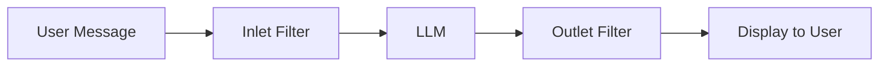

# Filter 插件

Filter 插件会在消息发送到 LLM 之前或响应生成之后处理和修改内容。

## 什么是 Filters？

Filter 充当消息管线中的中间件：

- :material-arrow-right-bold: **Inlet**：在消息到达 LLM 前处理用户消息
- :material-arrow-left-bold: **Outlet**：在展示前处理 LLM 响应
- :material-stream: **Stream**：对流式响应进行实时处理

---

## 可用的 Filter 插件

<div class="grid cards" markdown>

-   :material-compress:{ .lg .middle } **Async Context Compression**

    ---

    通过智能总结减少长对话的 token 消耗，同时保持连贯性。

    **版本：** 1.1.0

    [:octicons-arrow-right-24: 查看文档](async-context-compression.md)

-   :material-text-box-plus:{ .lg .middle } **Context Enhancement**

    ---

    为聊天增加额外信息，提升回复质量。

    **版本：** 1.0.0

    [:octicons-arrow-right-24: 查看文档](context-enhancement.md)

-   :material-google:{ .lg .middle } **Gemini Manifold Companion**

    ---

    Gemini Manifold Pipe 插件的伴随过滤器。

    **版本：** 1.0.0

    [:octicons-arrow-right-24: 查看文档](gemini-manifold-companion.md)

</div>

---

## Filter 工作流程



### Inlet 处理

`inlet` 方法在消息到达 LLM 前处理：

```python
async def inlet(self, body: dict, __metadata__: dict) -> dict:
    # 在发送到 LLM 前修改请求
    messages = body.get("messages", [])
    # 添加上下文、调整 prompt 等
    return body
```

### Outlet 处理

`outlet` 方法在响应生成后处理：

```python
async def outlet(self, body: dict, __metadata__: dict) -> dict:
    # 在展示前修改响应
    messages = body.get("messages", [])
    # 格式化输出、追加引用等
    return body
```

---

## 快速安装

1. 下载需要的 Filter `.py` 文件
2. 前往 **Admin Panel** → **Settings** → **Functions**
3. 上传文件并配置
4. 在聊天设置或全局启用该过滤器

---

## 开发模板

```python
"""
title: My Custom Filter
author: Your Name
version: 1.0.0
description: Description of your filter plugin
"""

from pydantic import BaseModel, Field
from typing import Optional

class Filter:
    class Valves(BaseModel):
        priority: int = Field(
            default=0,
            description="Filter priority (lower = earlier execution)"
        )
        enabled: bool = Field(
            default=True,
            description="Enable/disable this filter"
        )
    
    def __init__(self):
        self.valves = self.Valves()
    
    async def inlet(
        self,
        body: dict,
        __user__: Optional[dict] = None,
        __metadata__: Optional[dict] = None
    ) -> dict:
        """Process messages before sending to LLM."""
        if not self.valves.enabled:
            return body
        
        # 你的 inlet 逻辑
        messages = body.get("messages", [])
        
        return body
    
    async def outlet(
        self,
        body: dict,
        __user__: Optional[dict] = None,
        __metadata__: Optional[dict] = None
    ) -> dict:
        """Process responses before displaying."""
        if not self.valves.enabled:
            return body
        
        # 你的 outlet 逻辑
        
        return body
```

更多细节见 [插件开发指南](../../development/plugin-guide.md)。
