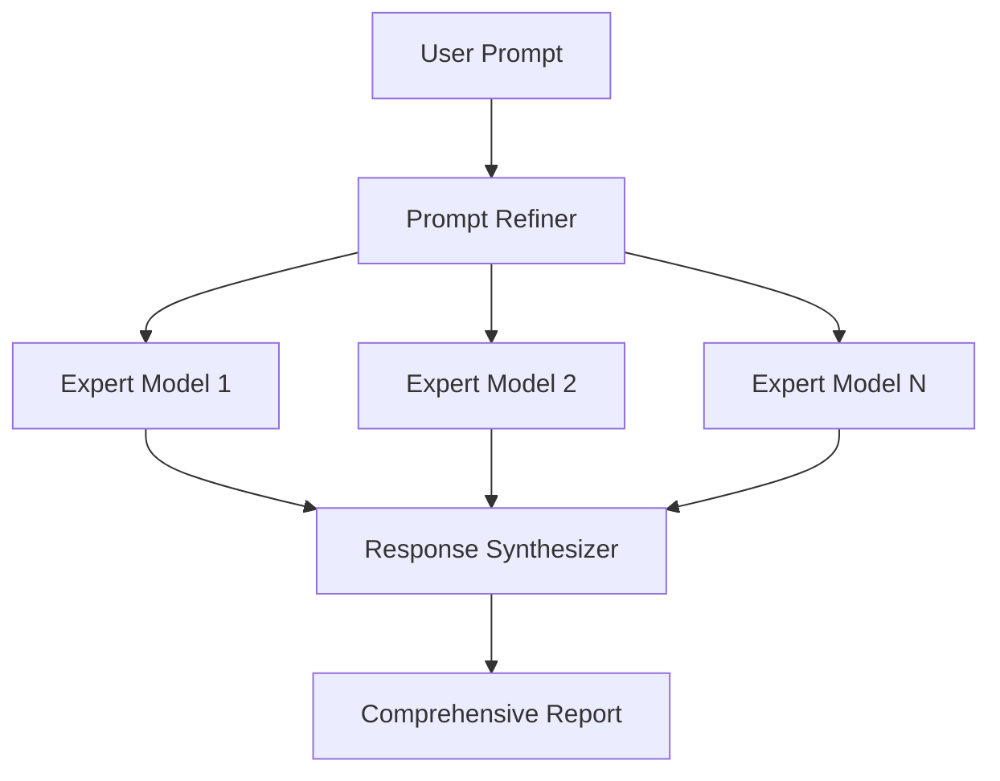

# MoE Prompt Refiner

<span class="category-badge pipeline">Pipeline</span>
<span class="version-badge">v1.0.0</span>

为 Mixture of Experts（MoE）汇总请求优化提示词，生成高质量的综合报告。

---

## 概览

MoE Prompt Refiner 是一个高级 Pipeline，会在将请求发送给多个专家模型前先优化提示词，然后综合各模型回复，输出结构化的高质量报告。

## 功能特性

- :material-view-module: **多模型**：同时利用多个 AI 模型
- :material-text-search: **提示词优化**：在发送前优化 prompt 获得更好结果
- :material-merge: **结果合成**：整合专家回复
- :material-file-document: **报告生成**：输出结构化报告

---

## 安装

1. 下载 Pipeline 文件：[`moe_prompt_refiner.py`](https://github.com/Fu-Jie/awesome-openwebui/tree/main/plugins/pipelines)
2. 上传到 OpenWebUI：**Admin Panel** → **Settings** → **Functions**
3. 配置专家模型及相关参数
4. 启用该 Pipeline

---

## 工作流程



---

## 配置项

| 选项 | 类型 | 默认值 | 说明 |
|--------|------|---------|-------------|
| `expert_models` | list | `[]` | 需要咨询的模型列表 |
| `synthesis_model` | string | `"auto"` | 用于综合回复的模型 |
| `report_format` | string | `"markdown"` | 输出格式 |

---

## 适用场景

- **研究报告**：从多个 AI 视角收集洞见
- **综合分析**：多角度问题拆解
- **决策支持**：获得多模型的平衡建议
- **内容创作**：生成多视角的丰富内容

---

## 示例

**输入 Prompt：**
```
Analyze the pros and cons of microservices architecture
```

**输出报告：**
```markdown
# Microservices Architecture Analysis

## Executive Summary
Based on analysis from multiple expert perspectives...

## Advantages
1. **Scalability** (Expert A)...
2. **Technology Flexibility** (Expert B)...

## Disadvantages
1. **Complexity** (Expert A)...
2. **Distributed System Challenges** (Expert C)...

## Recommendations
Synthesized recommendations based on expert consensus...
```

---

## 运行要求

!!! note "前置条件"
    - OpenWebUI v0.3.0 及以上
    - 可以访问多个 LLM 模型
    - 有足够的 API 配额支撑多模型请求

!!! warning "资源消耗"
    此 Pipeline 每次请求会进行多次 API 调用，请关注用量与成本。

---

## 源码

[:fontawesome-brands-github: 在 GitHub 查看](https://github.com/Fu-Jie/awesome-openwebui/tree/main/plugins/pipelines){ .md-button }
